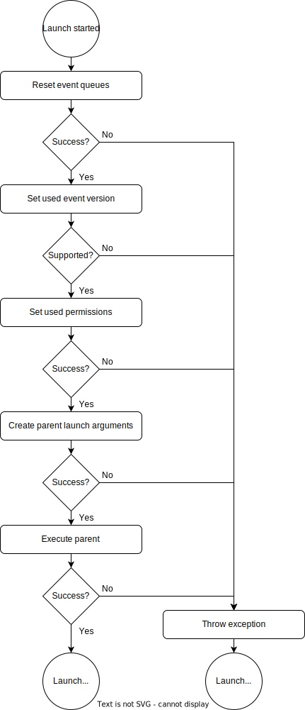

****************************
Application Service Starting
****************************
All user application services are started by mrhcore. All user application 
services launched use a user application service parent binary. This binary 
is used by mrhcore to both launch and control the currently running user 
application service.

User Application Service Parent
-------------------------------
Each user application service is started by using a user application service 
parent binary, defined in the :doc:`core configuration <../Configurations/Core_Configuration>` 
with the **AppServiceParentBinaryPath** key.

mrhcore will start the user application service parent as a child process and 
provide it with all necessary information to start the set user application 
service package.

Process Setup
-------------
The process setup performed for a user application service to launch is always 
done the same way:

.. note:: 

    Some steps (like event limits) are handled by the :doc:`service pool <A_Service_Pool>`.

Each step is required in the order in which it is performed. The steps 
are performed for the following reasons:

.. list-table::
    :header-rows: 1

    * - Step
      - Description
    * - Reset event queues
      - The event queue is reset to an initial starting state to not include old 
        events from previous processes.
    * - Set used event version
      - The package application event version is checked to make sure mrhcore 
        knows all used events.
    * - Set used permissions
      - :doc:`User application service permissions <Permissions>` are set to limit 
        which events can be sent and received.
    * - Create parent launch arguments
      - The parent receives event limits, event queue file descriptors and more 
        with the used launch parameters.
    * - Execute parent
      - The parent is started as a child process of mrhcore itself.

Failing to Launch
-----------------
mrhcore will not attempt to automatically retry failed user application service 
launches. Failed launches will simply be ignored.   
