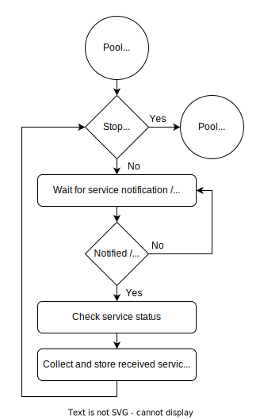
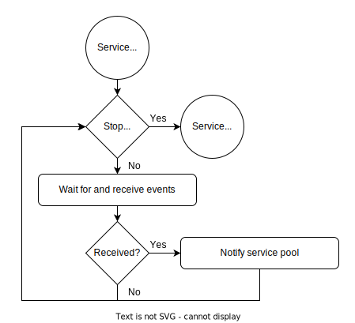

**************
Event Exchange
**************
All events sent by a user application service are sent with the help of 
a event queue provided by mrhcore. The core receives events from a 
user application service to hand to matching platform services.

mrhcore will also check if events are allowed to sent by the current 
application service based on the application permissions and event type.

Each update is limited by both timeout and number of events. mrhcore 
keeps track of those limitations with the service pools and updates 
the event exchange by those limits.

.. warning::

    User application services are only able to send events.

Event Limitations
-----------------
Events sent by application services are limited by the application permissions. 
mrhcore will check the set permissions before handing off events to platform 
services, and discard the events if the permissions are missing.

.. note:: 

    User application services will not be informed if event permissions 
    are missing.

Another limitation of the events sendable by user application services are 
the events itself. User application services are limited to specific events 
which can only be sent by the services.

.. toctree::
   :maxdepth: 1

   Version 1 Events<Event_Exchange/Version_1>
   

Event Reset
-----------
User application services do not require a event reset, unlike normal user 
applications.

Exchanging Events
-----------------
mrhcore exchanges events between the running user application services and available platform 
services by communicating with the user application service service pool, which collects received 
events from application services.

The application service pool itself waits for the individual services to notify it of any 
received events. Being notified of received events will cause the service pool to check 
all services for events to collect.

.. note:: 

    The order in which events are received from user application services is 
    not guaranteed.

Each service updates itself independently from the application service pool. The services wait 
and receive events from the user application service parent processes. The services then notify 
the service pool of events received by themselves.

.. note::

    The number of events sent and received for each service is limited by the 
    event limits set in the :doc:`core configuration <../Configurations/Core_Configuration>`.

