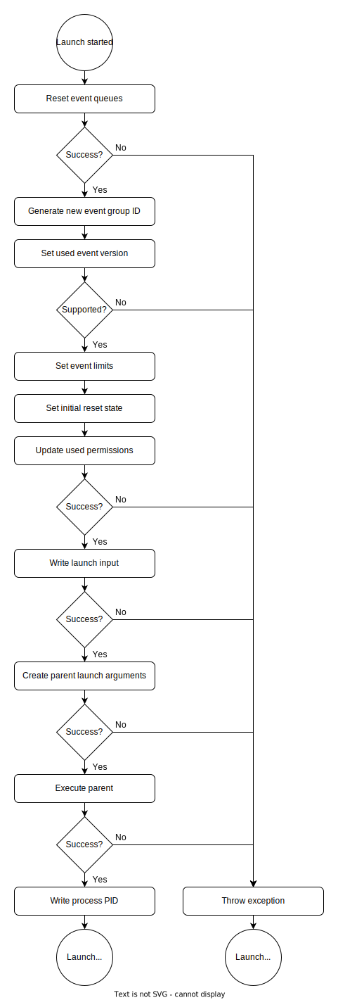

********************
Application Starting
********************
All user application are started by mrhcore. What application to launch 
is dependent on the type of application: The home package will be launched 
by mrhcore itself, while all other application packages will be launched 
if requested.

All application launched use a user application parent binary. This binary 
is used by mrhcore to both launch and control the currently running user 
application.

.. note::
    
    Only events received from a platform service can be used to 
    handle application package launches.

Setting a Launch
----------------
Every user application requested to launch (excluding the home package) 
are set by a platform service sending the **MRH_EVENT_APP_LAUNCH_SOA_S** 
event. mrhcore will read this event before handing it off to the current 
user application and set the next package to launch accordingly.

Setting a launch will not stop the current user application. The current 
application has to stop before the now set user application package will 
be launched by mrhcore.

Cancelling a Launch
-------------------
The currently set package launch can be cancelled. This is done when mrhcore 
receives the **MRH_EVENT_APP_LAUNCH_SOA_CLEAR_S** event.

User Application Parent
-----------------------
Each user application is started by using a user application parent binary, 
defined in the :doc:`core configuration <../Configurations/Core_Configuration>` 
with the **AppParentBinaryPath** key.

mrhcore will start the user application parent as a child process and 
provide it with all necessary information to start the set user application 
package.

.. note::

    The user application parent is the same for all application types.

Process Setup
-------------
The process setup performed for the user application to launch is always 
done the same way:

   

Each step is required in the order in which it is performed. The steps 
are performed for the following reasons:

.. list-table::
    :header-rows: 1

    * - Step
      - Description
    * - Reset event queues
      - The event queue is reset to an initial starting state to not include old 
        events from previous processes.
    * - Generate new event group ID
      - A new process event group ID is generated to make sure only events meant 
        for the user application are given to it.
    * - Set used event version
      - The package application event version is checked to make sure mrhcore 
        knows all used events.
    * - Set event limits
      - Event limits and timeouts are set, which allows mrhcore to limit how many 
        events are sent and received each update.
    * - Set initial reset state
      - The initial state of the service reset process is set to enforce a event 
        reset request
    * - Update used permissions
      - :doc:`User application permissions <Permissions>` are set to limit which 
        events can be sent and received.
    * - Write launch input
      - Launch input is written to a set file to allow for whitespaces and other 
        special characters.
    * - Create parent launch arguments
      - The parent receives event limits, event queue file descriptors and more 
        with the used launch parameters.
    * - Execute parent
      - The parent is started as a child process of mrhcore itself.
    * - Write process PID
      - The process PID is written for other components to access the currently 
        running user application.

Failing to Launch
-----------------
mrhcore will default to the home package defined in the configuration if 
the user application set to launch fails to do so.

.. warning::

    Failing to launch the home package will terminate mrhcore!
    
