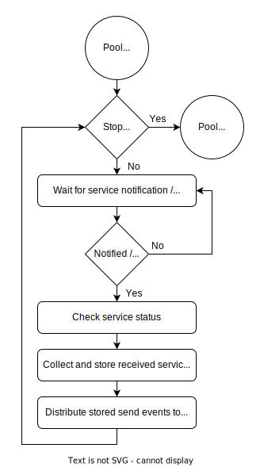
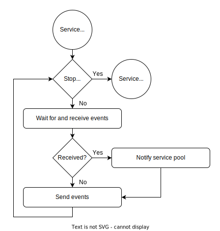

**************
Event Exchange
**************
All events exchanged by platform services are sent and received with the 
help of a event queue provided by mrhcore. The core receives events from 
the platform services with the :doc:`platform service pool <P_Service_Pool>` 
to hand to the current user application. Events for the platform services 
are handed to the service pool to distribute with the help of event routes.

Each update is limited by both timeout and number of events. The platform 
service pool keeps track of those limitations and updates the event exchange 
by those limits.

Event Limitations
-----------------
Only events intended to be sent from user applications are able to be sent to 
platform services. The service pool will filter events depending on their type 
to make sure no service events are sent to platform services.

.. note::

    Wrong events are discarded without notifying the current user application.
    

User Event Routes
-----------------
Events sent by user applications and user application services are assigned to 
platform services by using :doc:`user event routes <../Configurations/User_Event_Route>`.

The event routes defines which platform services are responsible for handling a 
specifc user application event. 

.. note::

    Events are duplicated if more than one service reacts to them.

Exchanging Events
-----------------
mrhcore exchanges events between the running user application, user application services 
and available platform services by communicating with the platform service pool, which 
internally distributes events to send and collects received events from platform services.

The platform service pool itself waits for the individual services to notify it of any 
received events. Being notified of received events will cause the service pool to check 
all services for events to collect. The service pool also distributes the events to be 
sent to platform services by using the event routes and events available. 

.. note:: 

    The order in which events are given to and received from platform services is 
    not guaranteed.

Each service updates itself independently from the platform service pool. The services wait 
and receive events from the service processes and then send events stored to send.
The services notify the service pool of events received by themselves.

.. note::

    The number of events sent and received for each service is limited by the 
    event limits set in the :doc:`core configuration <../Configurations/Core_Configuration>`.