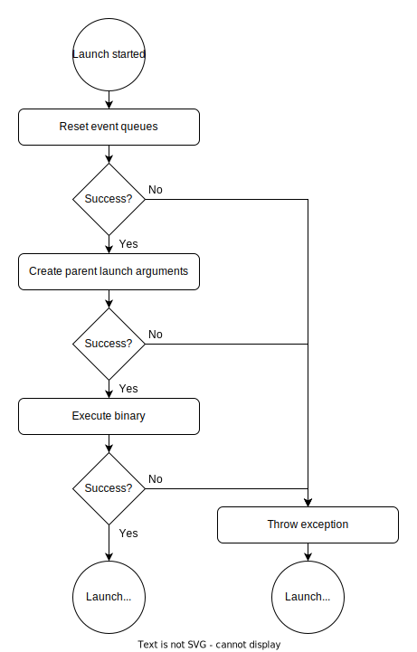

*************************
Platform Service Starting
*************************
All platform services are started by mrhcore by using the binary specified 
for the service. This binary is supplied with neccessary information like the 
event queues to use but not directly controlled by mrhcore.

Platform Service Binary
-----------------------
Every platform service is supplied to the MRH platform by its own binary file 
executed by mrhcore. The binary to use is defined in the 
:doc:`platform service list <../Configurations/Platform_Service_List>`.

mrhcore will start the platform service as a child process and provide it with 
all necessary information to start and communicate with the platform.

Process Setup
-------------
The process setup performed for a platform service to launch is always done the 
same way:

.. note:: 

    Some steps (like event limits) are handled by the :doc:`service pool <P_Service_Pool>`.

Each step is required in the order in which it is performed. The steps 
are performed for the following reasons:

.. list-table::
    :header-rows: 1

    * - Step
      - Description
    * - Reset event queues
      - The event queue is reset to an initial starting state to not include old 
        events from previous processes.
    * - Create parent launch arguments
      - The parent receives event limits, event queue file descriptors and more 
        with the used launch parameters.
    * - Execute binary
      - The binary is started as a child process of mrhcore itself.

Failing to Launch
-----------------
The behaviour for a failed platform service launch depends on the platform service type. 
Non-essential platform services are ignored, while essential services cause mrhcore to 
terminate. 
