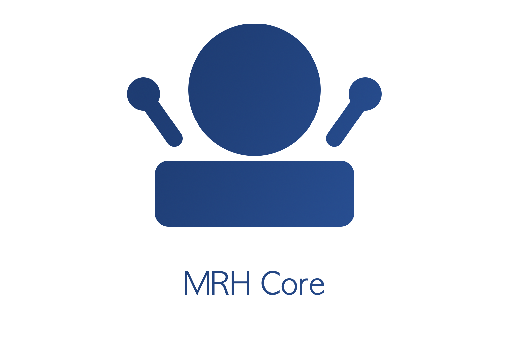

mrhcore
=======

   
   
mrhcore is the cental point of the MRH platform. The core sits between 
user applications, user application services and platform services and 
handles all communication between components. 

**Here are some of the things mrhcore does:**

* Manage user applications and user services
* Manage platform services 
* Provides control over the currently running user application
* Handles event exchanges and permissions
* ... 

mrhcore is considered to be the one standardized component together with 
the default events provided by the MRH platform. This allows customized 
components to always work with a default component which provides event 
exchange IPC methods as well as permissions and other enchancements. 

.. toctree::
   :maxdepth: 2
   :caption: Contents:

   Building/Building
   Configurations/Configurations
   Run_Diagrams/Run_Diagrams
   Event_Handling/Event_Handling
   Application_Handling/Application_Handling
   A_Service_Handling/A_Service_Handling
   P_Service_Handling/P_Service_Handling
